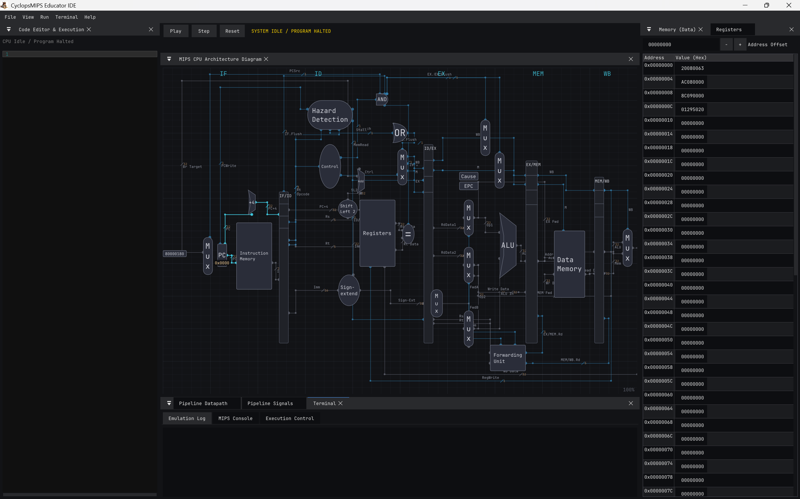
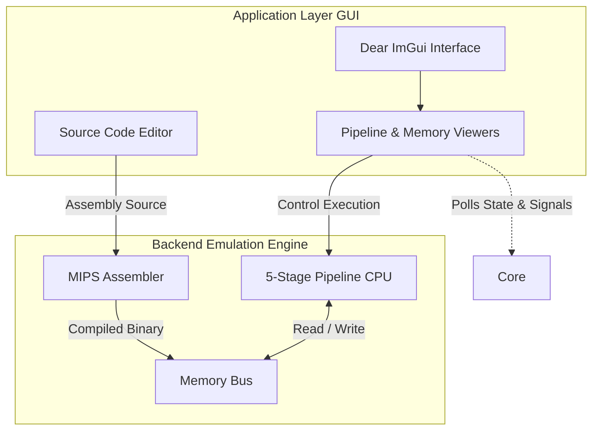
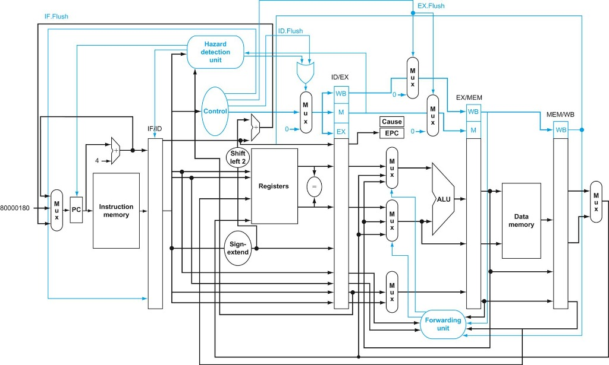

# CyclopsMIPS

CyclopsMIPS is an educational, cycle-accurate simulator and Integrated Development Environment (IDE) for the MIPS32 instruction set architecture. Built entirely in C++23, it provides a highly visual and interactive platform designed for computer architecture students and professionals to observe instruction pipelining, hazard handling, and memory hierarchy behaviors in real time.

## Project Showcase



### Video Demonstration
[](https://youtu.be/IIRngWyxCRU?si=NqAj7FSo2VIVv1t8)

---

## Core Features

- **Visual Pipeline Simulation**: Observe instructions transitioning through the classic 5-stage MIPS pipeline (Fetch, Decode, Execute, Memory, Writeback).
- **Cycle-Accurate Execution**: Execute programs cycle-by-cycle to deeply analyze component states, forward data paths, and control signals.
- **Advanced Hazard Resolution**: The simulation actively performs hazard detection, injecting pipeline bubbles and flushing upon branch mispredictions.
- **Built-in MIPS Assembler**: Write assembly code directly in the embedded text editor and compile it to machine code instantly without relying on external toolchains.
- **Interactive Datapath Inspection**: Visualize the active state of data flows on the CPU schematic, allowing direct inspection of multiplexer selections, ALU operations, and register mutations.
- **Extensible Memory System**: Inspect memory contents seamlessly and observe cache integration via the core `MemoryBus`.

---

## System Architecture

CyclopsMIPS is architected in two decoupled layers: **CyclopsCore** (the backend simulation engine) and **CyclopsApp** (the graphical frontend). 



### The Backend: CyclopsCore
The core emulation logic operates independently of the UI overhead, emphasizing cycle-accuracy and modularity.
- **Engine**: A high-performance, single-threaded clock stepping mechanism.
- **Memory Subsystem**: Centralized configuration through `MemoryBus`, modeling physical addressing capabilities.
- **Processor**: A robust CPU model encapsulating Branch Prediction, Forwarding logic, and discrete implementations for each pipeline stage.

### The Frontend: CyclopsApp
Powered by **OpenGL 3.3** and **Dear ImGui**, the frontend is designed with professional desktop application standards.
- **Workspace**: A modular, VS Code-inspired docking interface.
- **Concurrency**: Simulation computations occur on a dedicated background thread, safely synchronizing state with the render thread via concurrency primitives (`std::atomic`).

### MIPS Pipeline Datapath

The core simulation directly models the traditional Patterson & Hennessy schematic.



---

## Build Instructions

### Prerequisites
- **Compiler**: Full C++23 support (MSVC 17.x+, GCC 13+, Clang 16+)
- **Build System**: CMake 3.20 or newer
- **Operating System**: Cross-platform support (Windows, macOS, Linux)

### Generation and Compilation

```bash
# Clone the repository
git clone https://github.com/Souradeep1101/CyclopsMIPS.git
cd CyclopsMIPS

# Generate the build matrix
cmake -B out/build

# Compile the project
cmake --build out/build --config Release
```

The resulting executable will be generated at `out/build/bin/Release/CyclopsApp.exe` (or equivalent path for UNIX systems).

---

## License

This project is open-source and distributed under the MIT License. See `LICENSE` for more information.
